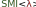

Serverless Message Interface      {#mainpage}
============



## Getting Started
### C++
```cpp
#include <smi.h>
...
FMI::Communicator comm(peer_id, 3, config_path, comm_name);
FMI::Comm::Data<double> d;
FMI::Comm::Data<std::vector<int>> vec({0, 1, 2});
if (peer_id == 0) {
    d = 42.0;
}
FMI::Comm::Data<std::vector<int>> recv(1);
comm.bcast(d, 0);
comm.scatter(vec, recv, 0);
assert(d == 42.0);
assert(recv.get()[0] == peer_id);
FMI::Utils::Function<int> f([] (int a, int b) {return a + b;}, true, true);
FMI::Comm::Data<int> id = peer_id;
FMI::Comm::Data<int> id_sum;
comm.allreduce(id, id_sum, f);
assert(id_sum == 3);
```

### Python
```python
import smi
...
comm = smi.Communicator(peer_id, 3, config_path, comm_name)
if peer_id == 0:
    comm.bcast(42, 0, smi.types(smi.datatypes.int))
else:
    bc_res = comm.bcast(None, 0, smi.types(smi.datatypes.int))
    assert bc_res == 42
sc_res = comm.scatter([0, 1, 2], 0, smi.types(smi.datatypes.int_list, 3))
assert sc_res[0] == peer_id
id_sum = comm.allreduce(peer_id, smi.func(smi.op.sum),
                        smi.types(smi.datatypes.int))
assert id_sum == 3
id_custom = comm.allreduce(peer_id,
             smi.func(smi.op.custom, lambda a, b: 3 * a + b, False, False),
             smi.types(smi.datatypes.int))
assert id_custom == 5 # Left-to-right order because of non-assoc. / non-comm.
```